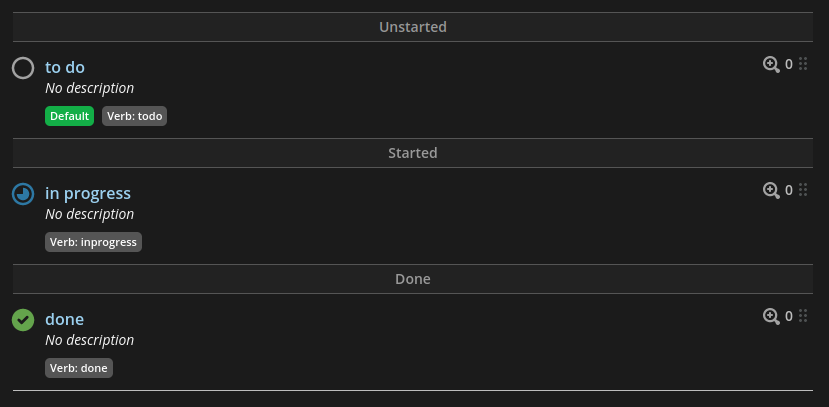

Shortcut required some setup as it is asked in the [test](/doc/tech_test.md)

# Create the workflow

First create a workflow in https://app.shortcut.com/ggk/settings/teams

Create a new one and add its name in [.env](../.env)

# Create the states of the workflow

Go back to https://app.shortcut.com/ggk/settings/teams

Click `Edit Workflow States`

Here you can add your states, according to the CSV file we need

- `to do` this should belong to **Unstarted**
- `in progress` this should belong to **Started**
- `done` this should belong to **Done**

On my end it ended up looking like this 

# Note

Having to setup stuff on the Shortcut app to fit the CSV file is weird to me, I would have prefered the script to check if given workflow / states exist and creating them if they don't.